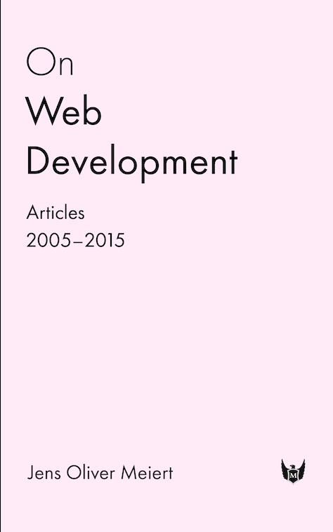

{sample: true}
# About the Author

Jens Oliver Meiert is a frontend engineering leader (e.g., Google, Miro) and author/publisher (O’Reilly, Frontend Dogma). He specializes in HTML and CSS optimization and large-scale maintainability, skills honed over more than 25 years of professional practice. A contributor to technical standards, Jens regularly writes about his work and research on his website, [meiert.com](https://meiert.com/).

Other titles by Jens Oliver Meiert:

## [_On Web Development_](https://meiert.com/blog/on-web-development/) (2015)

{width: 25%, float: right}

> _On Web Development_ bundles 134 articles and the last 11 years of technical writings by Jens Oliver Meiert (meiert.com). Freshly reordered and commented, the articles cover processes and maintenance, HTML and CSS, standards, as well as development and design in general; they include coding basics and principles, carefully scathing criticism, and tips and tricks and trivia.

Available at [Amazon](https://www.amazon.com/dp/B010PQPT90/?tag=meiert-20).

## [_The Little Book of Little Books_](https://meiert.com/blog/the-little-book-of-little-books/) (2021)

> _The Little Book of Little Books_ consists of lovingly polished editions of _The Little Book of HTML/CSS Frameworks_ (originally published in 2015), _The Little Book of HTML/CSS Coding Guidelines_ (2015), and _The Little Book of Website Quality Control_ (2016).

Available at [Amazon](https://www.amazon.com/dp/B09LLFH2RY/?tag=meiert-20), [Apple Books](https://books.apple.com/us/book/the-little-book-of-little-books/id1596573542), [Kobo](https://www.kobo.com/us/en/ebook/the-little-book-of-little-books), [Google Play Books](https://play.google.com/store/books/details?id=H3dOEAAAQBAJ), and [Leanpub](https://leanpub.com/little-books).

## _Upgrade Your HTML_ (2019–2024)

> The _Upgrade Your HTML_ series is about one thing: Picking examples of HTML in the wild, and explaining how to make that code better. Kindly. Constructively. Thoroughly, as finding a balance between detail and brevity permits.

Available at [Amazon](https://www.amazon.com/dp/B0B4SD84B2/?tag=meiert-20), [Apple Books](https://books.apple.com/us/book-series/upgrade-your-html/id1569607037), [Kobo](https://www.kobo.com/us/en/series/upgrade-your-html), [Google Play Books](https://play.google.com/store/books/series?id=5AksGwAAABDJEM), and [Leanpub](https://leanpub.com/b/upgrade-your-html-1-5).

## [_Rote Learning HTML & CSS_](https://meiert.com/blog/rote-learning-html-and-css/) (2024)

> Learn HTML and CSS, the hard way.

Available at [Apple Books](https://books.apple.com/us/book/rote-learning-html-css/id6633442792), [Kobo](https://www.kobo.com/us/en/ebook/rote-learning-html-css), [Google Play Books](https://play.google.com/store/books/details?id=KYAZEQAAQBAJ), and [Leanpub](https://leanpub.com/rote-learning-html-css).

## [_The Web Development Glossary 4K_](https://meiert.com/blog/the-web-development-glossary-4k/) (2026)

> What is 3P? Afferent coupling? Strict evaluation? What are CPH, cHTML, and CMF? How about Vanadium, OPcache, or Auto Forms Mode? Covering more than 4,000 terms and concepts, and including explanations from Wikipedia and MDN Web Docs, _The Web Development Glossary 4K_ provides an overview of web development unlike any other book or site.

Available at [Apple Books](https://books.apple.com/us/book/the-web-development-glossary-4k/id6760966634), [Google Play Books](https://play.google.com/store/books/details?id=WuDKEQAAQBAJ), and [Leanpub](https://leanpub.com/web-development-glossary-4k). (Try the glossary online at [WebGlossary.info](https://webglossary.info/)!)